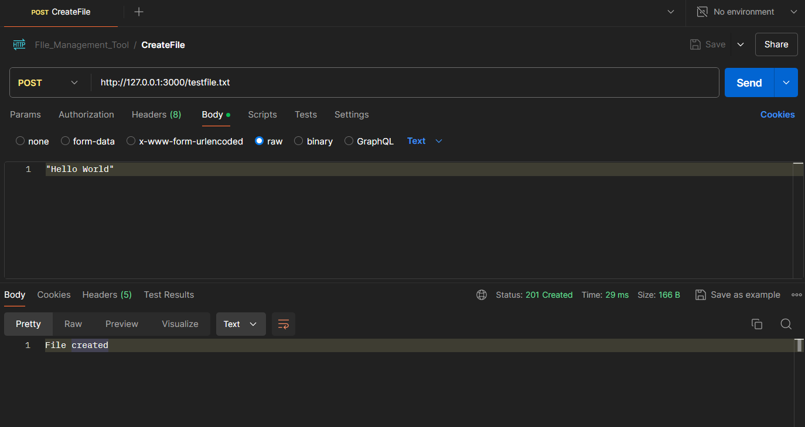
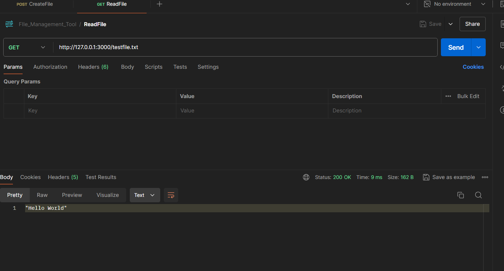
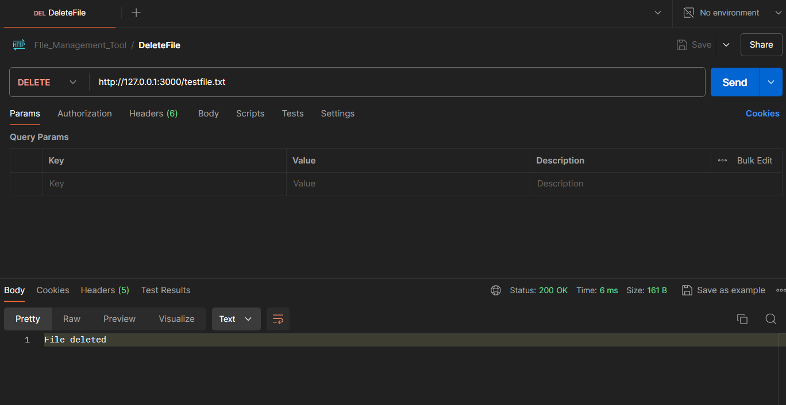

## CSI_2nd_Assignment(NodeJs)
### "File Management tool " application

- setup basic npm project by running `npm init --y`
- install the required packages such as *http*, *path* and *fs* by running the following command: `npm i <package_name>`
- write your code in *index.js* file to create a simple file management tool that can create, read, and delete files 
- download and setup *POSTMAN* in your system to test the api endpoints
    ### Steps to test the file management tool using Postman:
    - Open Postman
    - Create a new request:
        - Click on the New button and select HTTP Request
    #### Create a File
    - Set the request type to *POST*
    - Enter the request URL: `http://127.0.0.1:3000/testfile.txt`
    - Set the body content:
        - Go to the Body tab
        - Select raw
        - Choose Text from the dropdown
        - Enter the content you want to write to the file, eg. *Hello, World!*
    - Send the request:
        - Click on the Send button
        - You should see a response with *status 201 Created* and the message *File created*

    #### Read a File
    - Set the request type to *GET*
    - Enter the request URL: `http://127.0.0.1:3000/testfile.txt`
    - Send the request:
        - Click on the Send button.
        - You should see a response with *status 200 OK* and the content of the file, eg. *Hello, World!*

    #### Delete a File
    - Set the request type to *DELETE*
    - Enter the request URL: `http://127.0.0.1:3000/testfile.txt`
    - Send the request:
      - Click on the Send button.
      - You should see a response with *status 200 OK* and the message *File deleted*

